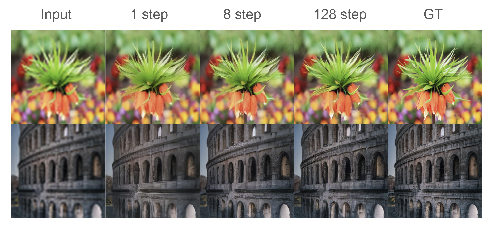
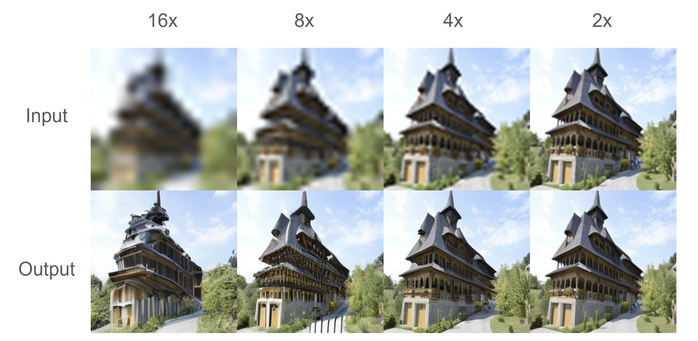

# CSE599S-ShortcutModel


## Project Description
We explore one-step flow matching for image super-resolution by extending shortcut models to use image conditions
instead of text prompts. Our goal is to evaluate whether image-conditioned shortcut models can achieve high-quality
super-resolution with minimal compute, and whether higher-order flow matching improves performance over standard
first-order velocity matching.

## Training
Split the high-res images into train and val directories. The dataloader in our script handles the down-sampling process automatically, based on the low_res_factor argument. Here we show an example training config for second order matching for 4x scale.
```
python train.py \
  --train_dir /data/imagenet/ilsvrc2012_train_task1-2 \
  --val_dir  ../data/hr_val \
  --output_dir ../output_homo \
  --image_size 256 \
  --low_res_factor 4 \
  --hidden_size 1152 \
  --patch_size 2 \
  --depth 28 \
  --num_heads 16 \
  --mlp_ratio 4 \
  --dropout 0.1 \
  --use_stable_vae \
  --batch_size 32 \
  --lr 1e-4 \
  --weight_decay 0.1 \
  --warmup 5000 \
  --max_steps 500000 \
  --save_interval 5000 \
  --eval_interval 1000 \
  --log_interval 100 \
  --use_cosine \
  --seed 42 \
  --num_workers 16 \
  --denoise_timesteps 128 \
  --target_update_rate 0.999 \
  --bootstrap_every 8 \
  --bootstrap_ema 1 \
  --cfg_scale 0 \
  --use_homo \
  --homo_lambda_v 1.0 \
  --homo_lambda_a 0.5 \
  --homo_lambda_sc 0.1
  ```

## Inference
Place the high-res image in a directory and pass it to the input_dir argument. This is counter-intuitive as the low-res images should be the input. But we use high-res images and let the script handle different down-sampling scales for less work on creating all the low-res images manually.
Make sure the config_path is consistent with the model checkpoint.
```
python inference.py \
  --input_dir ../data/lr_train_small \
  --output_dir ../data/output \
  --model_path ../output/ema_model_step_70000.pt \
  --config_path ../output/args.json \
  --steps 1 \
  --use_ema
```

## Checkpoints
We share two checkpoints along with their argconfig and training logs for both velocity and velocity + acceleration based flow matching.
The velocity based was trained with 310000 steps with a batch size of 96 and velocity + acceleration based was trained with 105000 steps with a batch size of 32. Both were trained on a single H200 on UW Hyak.
You can find the files here: [link to shared folder](https://drive.google.com/drive/folders/17RDc0iYNAZ2WPPajUQHcn_84hGZl_uTf?usp=sharing)